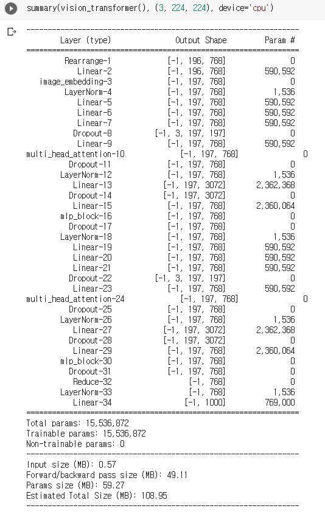
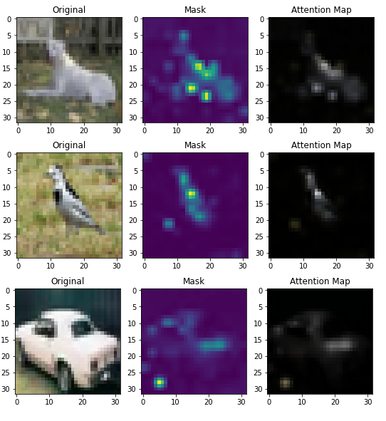

# Vision Transformer
- ViT Implmentation     
- Paper : An Image is Worth 16x16 Words: Transformers for Image Recognition at Scale (https://arxiv.org/pdf/2010.11929)

## ViT.ipynb
- implementation on image embedding & multihead attention modele
- easy rearrange with eionops
- simple performance test with cifar10

- summary example with 2 mha blocks    
    

## Attention visualization
- trained with only 100 sampled images for 5 epochs, need more training
    
